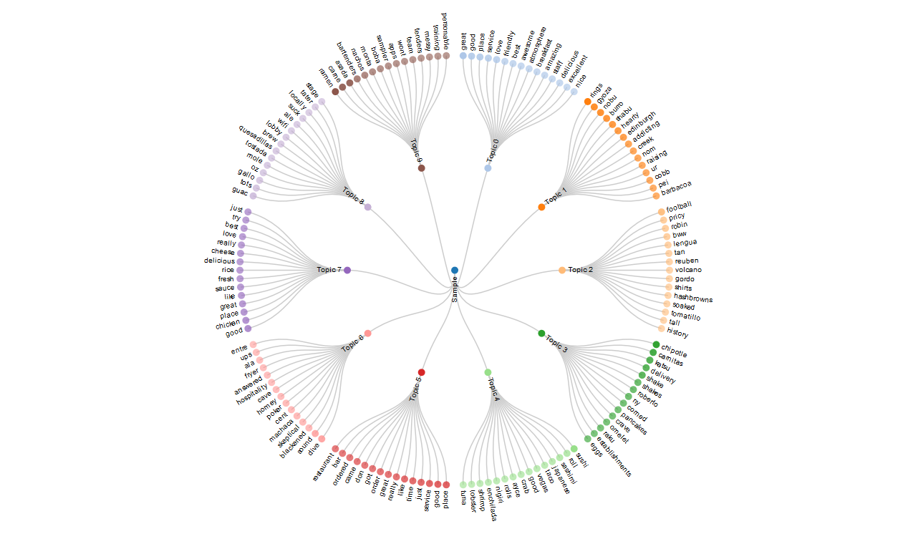

# Overview
The goal of the Data Mining Project is to provide you an opportunity to synthesize the knowledge and skills you’ve learned from previous courses and apply them to solve real-world data mining challenges. You will work on a restaurant review data set from Yelp and mine this data set to discover interesting and useful knowledge to help people make dining decisions, including constructing a cuisine map to help people understand the landscape of different cuisines, mining popular dishes of a given cuisine, recommending (i.e., ranking) restaurants for a given dish, and predicting hygiene of a restaurant.

There will be a set of mining tasks that you must finish. Each task is, in nature, similar to a programming assignment with experiments on a data set, though the actual amount of programming needed may vary since sometimes you might be using existing implementations of algorithms rather than writing your own implementation. The specification of each task is sufficiently general to provide flexibility for you to explore your own ideas, but we also provide a minimum requirement that is specific enough to allow you to easily finish each task.

The submission you need to generate for each task is generally a brief report documenting what you’ve done with some justification and explanation. At the end of the course, you will be asked to write a consolidated project report to summarize all your activities and present all your results.

# Instructions
**Before you begin, make sure you have downloaded the data set and any additional tools you wish to use, as described on the Data Set and Toolkit Acquisition page.**

The goal of this task is to explore the Yelp data set to get a sense about what the data look like and their characteristics. You can think about the goal as being to answer questions such as:

1. What are the major topics in the reviews? Are they different in the positive and negative reviews? Are they different for different cuisines?
2. What does the distribution of the number of reviews over other variables (e.g., cuisine, location) look like?
3. What does the distribution of ratings look like?

In general, you can address such questions by showing visualization of statistics computed based on the data set or topics extracted from review text.

## Task 1.1:

Use a topic model (e.g., PLSA or LDA) to extract topics from all the review text (or a large sample of them) and visualize the topics to understand what people have talked about in these reviews.

For example, after applying LDA to a sample of the reviews, we obtained the following visualization. Here the opacity of each node corresponds to its weight in each topic.

## Task 1.2:

Do the same for two subsets of reviews that are interesting to compare (e.g., positive vs. negative reviews for a particular cuisine or restaurant), and visually compare the topics extracted from the two subsets to help understand the similarity and differences between these topics extracted from the two subsets. You can form these two subsets in any way that you think is interesting. Here we show a sample visualization for a sample of reviews with high and low ratings.

## Submission
You must submit your report in PDF format. We suggest that it should be 2-3 pages long. Your report will need to include the following:

1. A brief description of what you did, including the topic model used, the parameters you’ve used, how you applied the model to the data set, what tool was used for visualization, etc. Did you use a subset of the data? If so, what was it?
2. Your visualization results for Task 1.1 and Task 1.2. You must include the images of your visualizations in your PDF report.
3. Your opinions about whether the results you generated make sense or are useful in any way. Your description should be detailed enough to allow others to replicate your work. Are there any particular aspects of your visualization to which you would like to bring attention? What do you think the data and your visualization show?