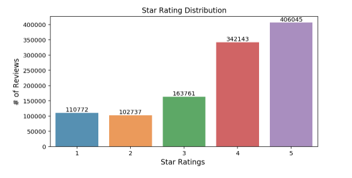
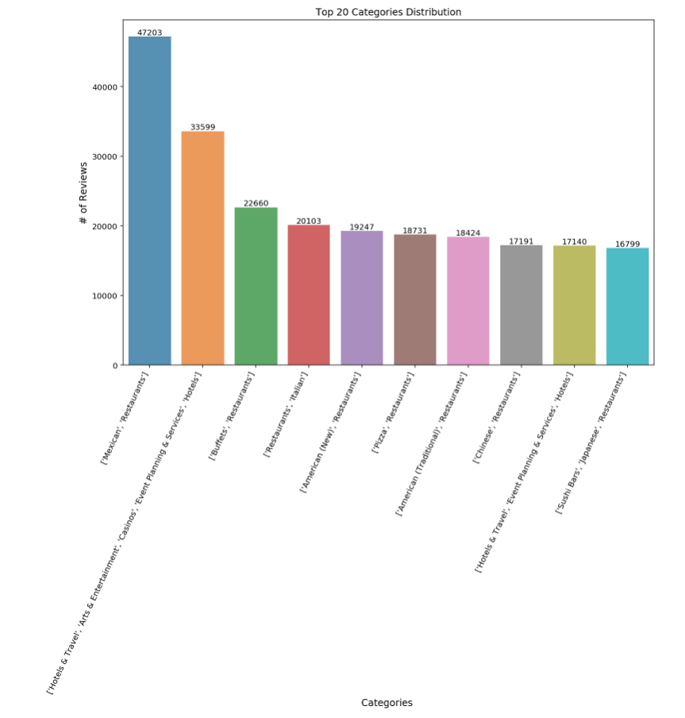
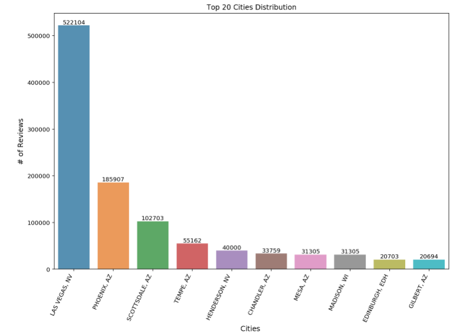
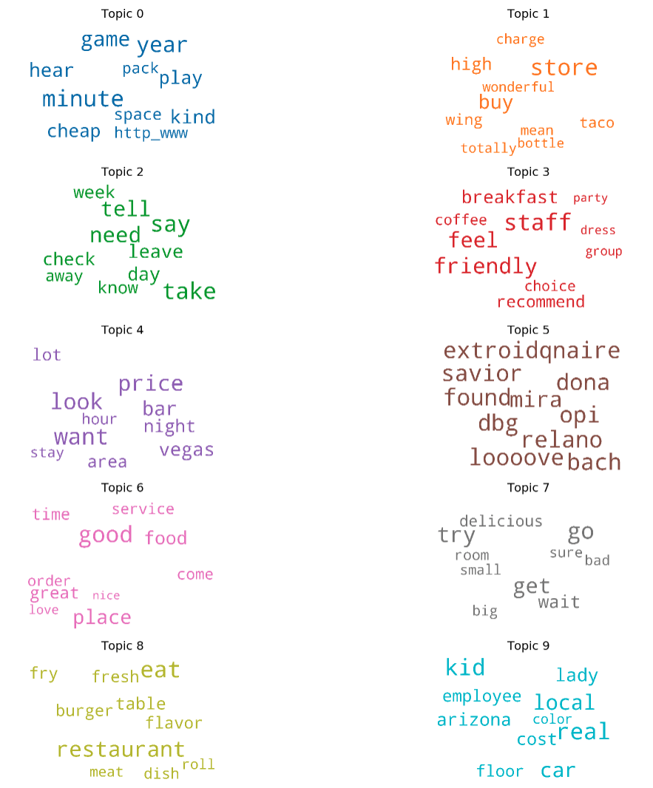
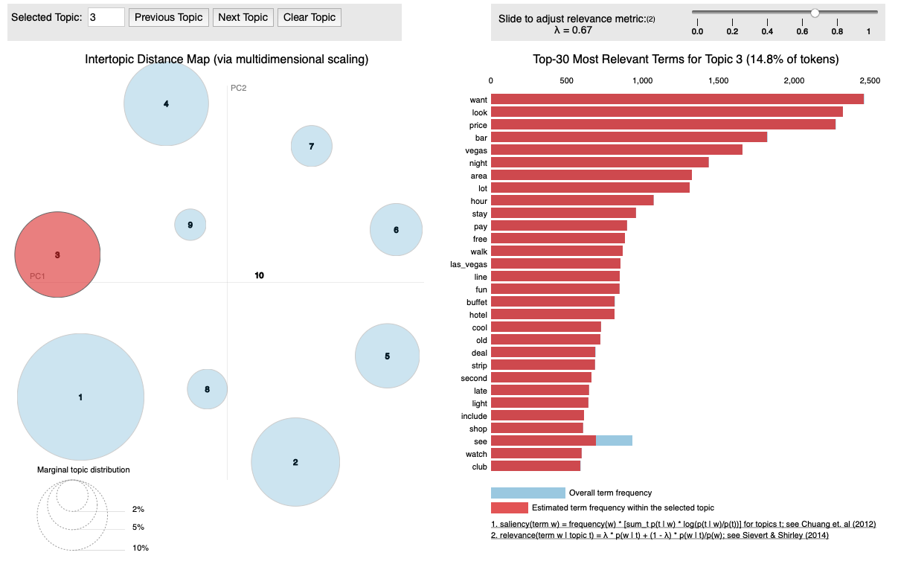
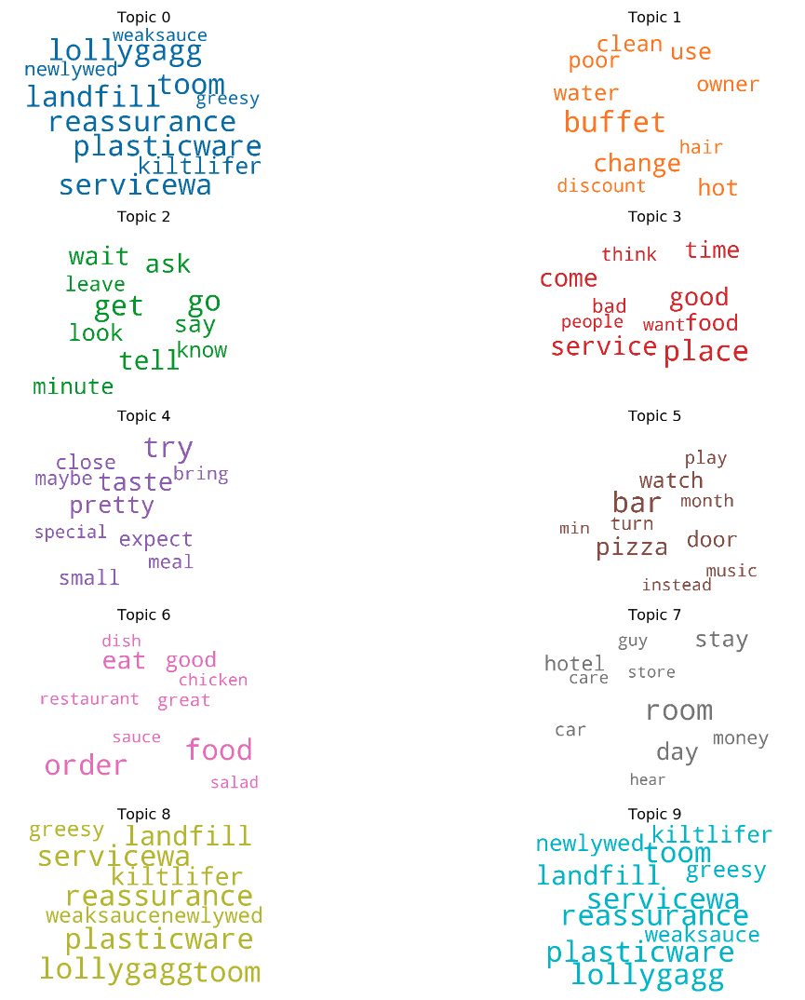
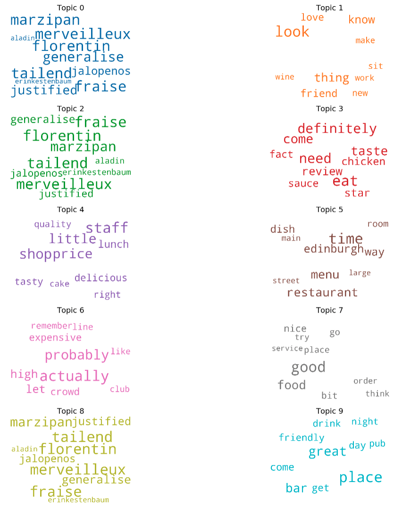

# Task 1
Notebook for this analysis can be @ https://github.com/jonchang03/cs598-dm-capstone/blob/master/task1/Task1.ipynb

The goal of this task is to explore the Yelp data set to get a sense about what the data look like and their characteristics. You can think about the goal as being to answer questions such as:

1. What are the major topics in the reviews? Are they different in the positive and negative reviews? Are they different for different cuisines?
2. What does the distribution of the number of reviews over other variables (e.g., cuisine, location) look like?
3. What does the distribution of ratings look like?

## Step 1. Preprocessing
Using Yelp's dataset [example code](https://github.com/Yelp/dataset-examples), we first convert our datasets from json to csv so that we can use pandas for our exploratory analysis. (Note that we needed to use a Python 2 environment for this task.)  
`$ python json_to_csv_converter.py yelp_academic_dataset.json # Creates yelp_academic_dataset.csv`

```
%%bash
cd ../yelp_dataset_challenge_academic_dataset
ls -al
source activate py2
which python

for file in *.json; do
    echo $file
    python json_to_csv_converter.py $file
done
```

### 1a. Read data + Joins
For now, let's join some other interesting variables to our *review dataset* from the *business dataset* which we can use to perform some interesting analysis later on. In particular, cusine (`categories`) and location (`city` and `state`) seem interesting. We'll do a join between the datasets, and only keep columns that will be useful for our analysis (e.g. text, stars, etc...)

### 1b. Distribution Plots
Let's first plot the ratings distribution to answer one of the high level goals of our exploratoray data analysis. We see that the vast majority of the reviews are positive based on Yelp's rating system of 1-5 stars. We could always go back and look at the distribution of ratings across various categories or locations, but I'll leave that to another time.


Now, let's look at the distribution of categories, filtered down to the top 10 most common categories. Although I commonly associate Yelp with restaurant reviews, this distribution plot reminds me that Yelp can also be used for reviews in other categories such as hotels.


And now, let's also look at the distribution of reviews across the top 10 cities. Apparently they really like to use Yelp in Las Vegas and Arizona 🤷‍♂️. Also, Yelp is very much alive in London!


### 1c. Sample + Preprocess
For our purposes, let us take a large random sample from the overall dataset.
Then, we perform some of the following preprocessing steps:
* tokenization
* remove punctuation, stopwords
* lemmatization + stemming
* construct bigiram and trigram models - just in case we mine such topics

At the end, we create a dictionary and corpus for our topic modeling.

## Step 2 - Topic Model LDA (Task 1.1)
Use a topic model (e.g., PLSA or LDA) to extract topics from all the review text (or a large sample of them) and visualize the topics to understand what people have talked about in these reviews.

For this topic model, we use Gensim's fast and efficient LDA implementation to train a model on the corpus we just created from Yelp data and extract the top 10 topics. We use LDA instead of pLSA both because of the popular implementation available via Gensim, but also because LDA should be able to generalize to new, unseen documents. Again, we used id2word dictionary which contains our mapping between word IDs and the actual words. We decided to use 10 documents per training chunk, and limit the maximum number of iterations to 100 when inferring topic distribution.

### 1.1a. Word Cloud
The word cloud, which we will use as our visualization of choice for the rest of this exercise, was probably the clearest way to represent the distinct topics and the most important words which are proportional to weight.

### 1.1b. Word Counts of Topic Words
This achieves a similar purpose to the word cloud, but is a bit more precise in that it allows us to see the exact importance or weight of the keywords for each topic. 


### 1.1c. pyLDAvis - interactive topic model visualization
pyLDAvis is a nice library that allows us to interact with our LDA model and view the topics, relevant terms, and distance matrix of the topics. More information can be found at these links. 
* https://github.com/bmabey/pyLDAvis
* https://cran.r-project.org/web/packages/LDAvis/vignettes/details.pdf


### Discussion
Based on the initial LDA model visualizations, I decided that word cloud was probably the best visual representation of text data, especially considering word frequencies. The more frequent the word in a topic, the larger and more prominent it is displayed. Thus, I decided to use it for task 1.2. However, the sorted bar chart view allow for more precision in understanding the exact term frequency across our subset corpus. This gives us a basis of comparison between topics because the weights we are using are the same. Finally, the pyLDAvis package enable better understanding of the fitted LDA model in attempt to answer questions such as the meaning of, prevalance of, and relation between the various topics. The original paper can be found [here](https://nlp.stanford.edu/events/illvi2014/papers/sievert-illvi2014.pdf).

## Task 1.2:

Do the same for two subsets of reviews that are interesting to compare (e.g., positive vs. negative reviews for a particular cuisine or restaurant), and visually compare the topics extracted from the two subsets to help understand the similarity and differences between these topics extracted from the two subsets. You can form these two subsets in any way that you think is interesting.

### 1.2a: LDA Positive Subset
To filter out positive reviews, we take a sample of reviews where the rating was greater than 4 stars.

### 1.2b: LDA Negative Subset
In order to focus on the extremes, we consider ratings of less than 2 stars as negative, and here we take a subset of negative reviews.

### 1.2c: LDA Specific Business or Location Subset
I'm interested in topic modeling for `EDINBURGH, EDH`, the one location in the top 10 cities that was outside of the U.S., so we'll take a subset of reviews from Edinburgh.

### Discussion
Overall, comparing various subsets of review data allowed for interesting analysis with LDA topic modeling. We can see that LDA has done a pretty good job of creating topical clusters for positive reviews, negative reviews, and reviews for services in Edinburgh, UK. For instance, the word clouds for the positive reviews higlights words such as: "highly_recommend", "special", "awesome", "thank", "delicious", "good", "great", etc... The word clouds for the negative reviews highlights words such as: "lollygagg", "wait", "expect", "wait", "leave", "reassurance", etc... And the word clouds associated with the UK reviews show words such as: "Merveilleux", "pub", "bar", "expensive", "florentin", and actually "edinburgh" itself! These prominent words within the topics make intuitive sense, but some of the topics themselves are reasonable. For instance, the positive reviews could include: a family enjoying their birthday celebration or a nice hotel room in Las Vegas. The negative reviews include waiters who are lollygagging, or customers who had to wait a long time for their service and had to leave. And the Edinburgh, UK reviews show a lot of fancy European cuisines which I don't entirely recognize, but also bars and pubs which the UK is known for. 

## References
* Gensim Docs - https://radimrehurek.com/gensim/models/phrases.html
* Preprocessing/LDA - https://www.machinelearningplus.com/nlp/topic-modeling-gensim-python/#4whatdoesldado
* Visualization - https://www.machinelearningplus.com/nlp/topic-modeling-visualization-how-to-present-results-lda-models/