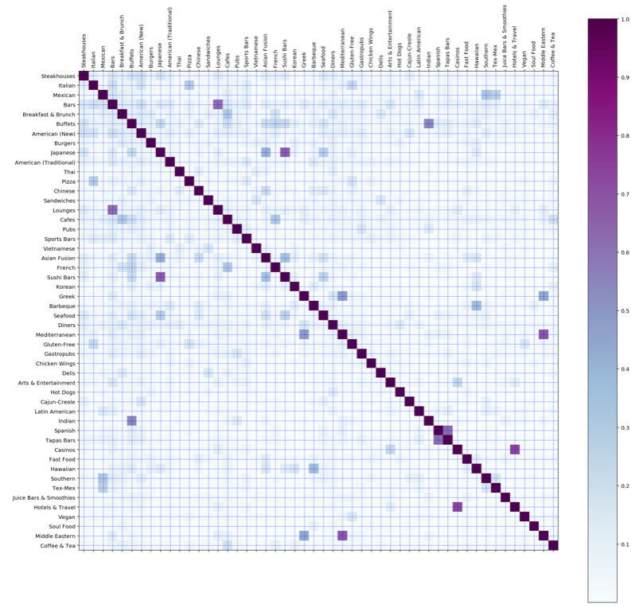
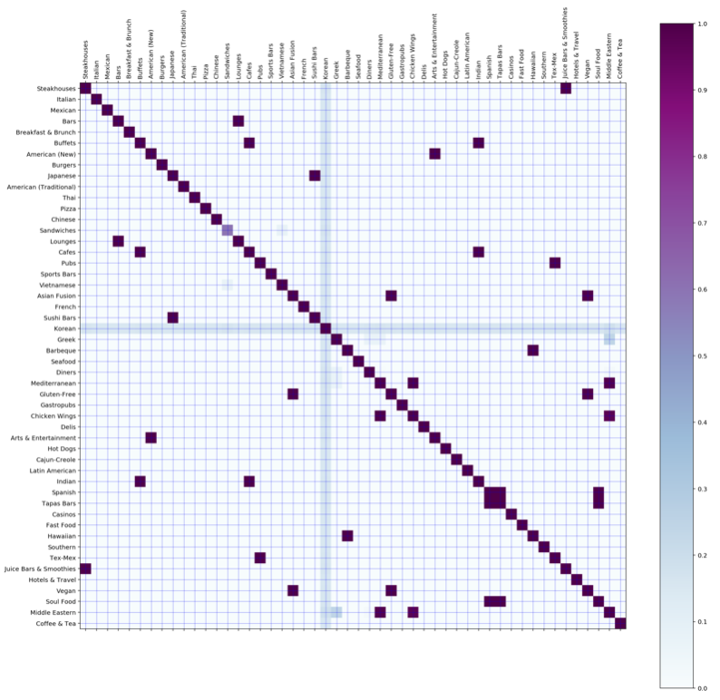
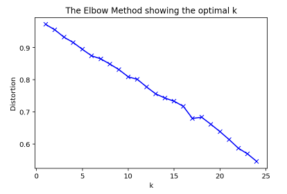
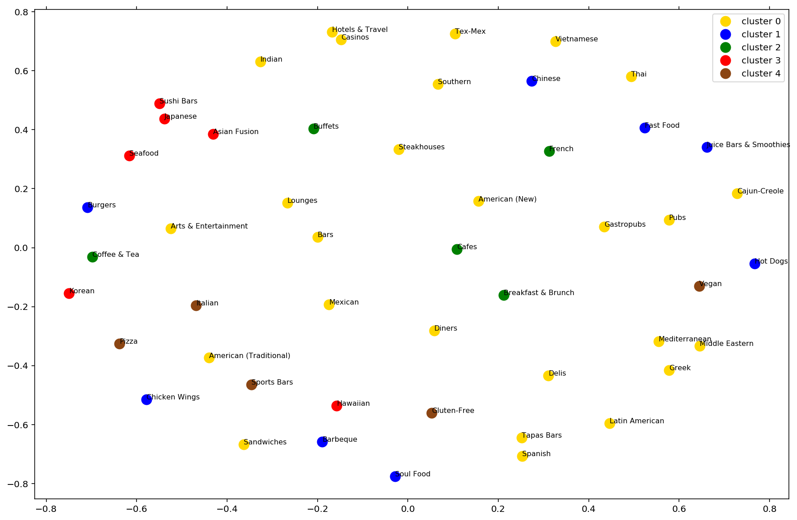
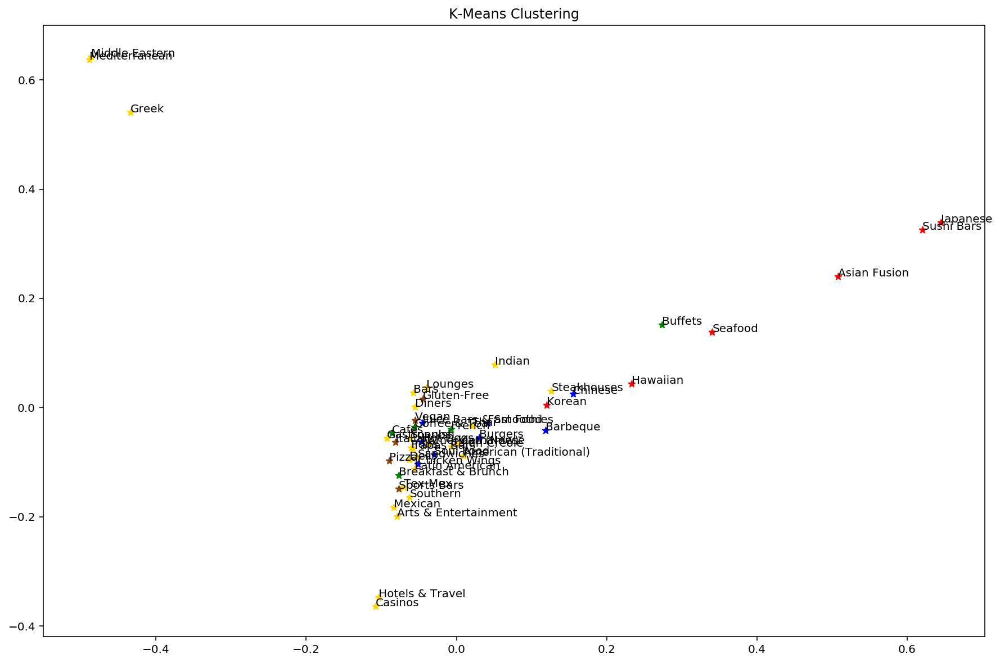
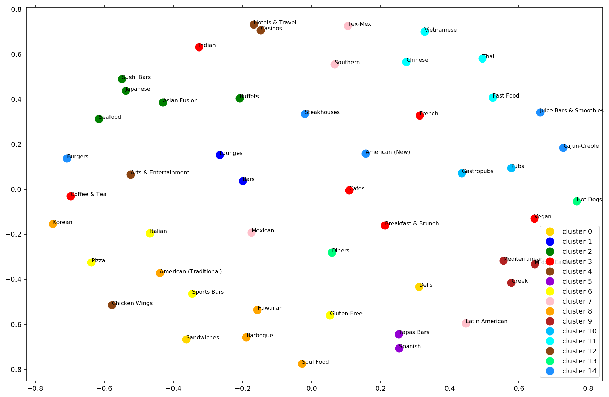
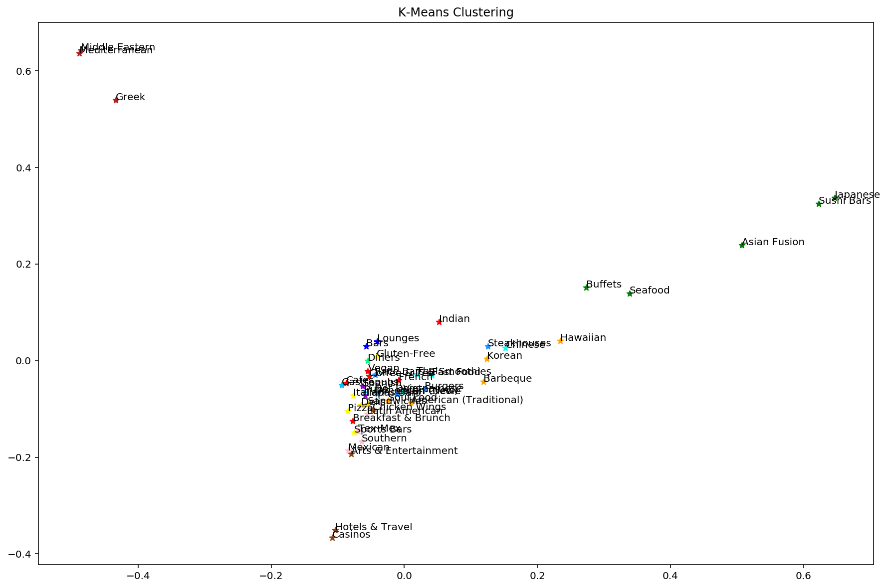
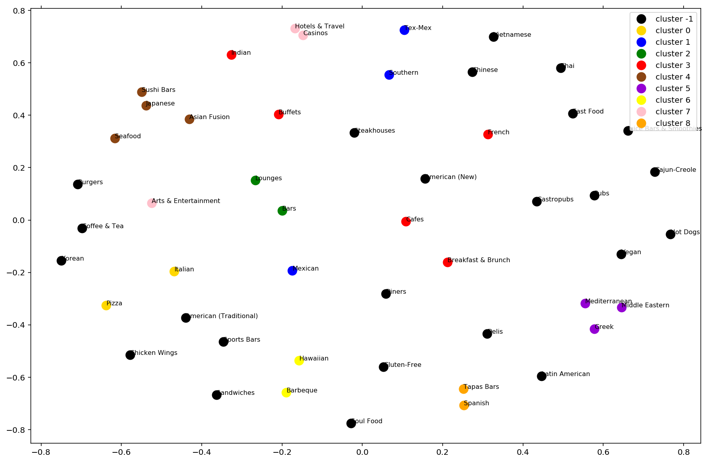
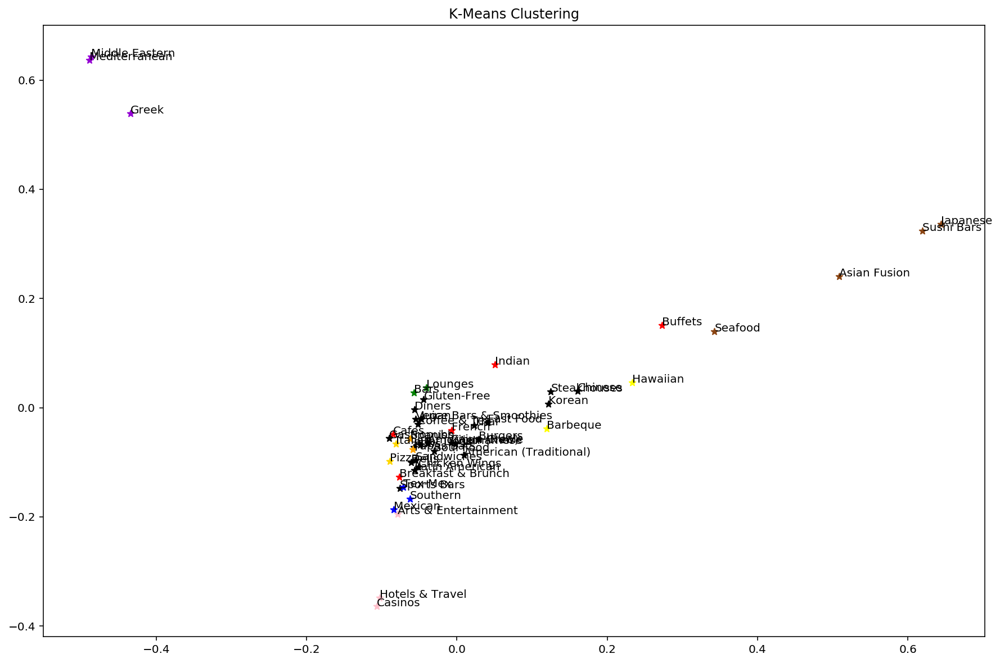
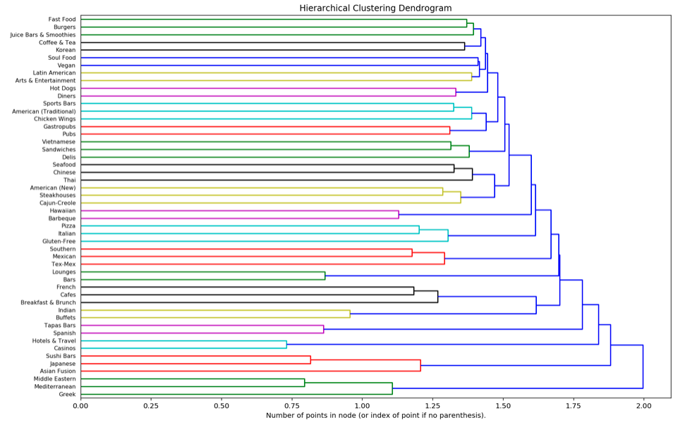

# Task 2
Notebook for this analysis can be @ https://github.com/jonchang03/cs598-dm-capstone/blob/master/task2/Task2.ipynb

## Preprocessing
1. First, I experimented with running the provided script `py27_processYelpRestaurants.py` several times to try generating my own categories. However, I ultimately used the categories provided and narrowed down my cuisine selection based on the top 50 categories with the most reviews. I then proceed to combine all the reviews for a cuisine.

2. Then, I performed preprocessing via sklearn's TfidfVectorizer and focus on some of the following parameters. These steps essentially filter out a bunch of tokens that are uninteresting to us.  
    * remove stop words using nltk's list 
    * decoding to utf8 and removing accents
    * convert all words to lowercase
    * min_df=n (ignore terms that occur fewer than n times)
    * max_df (ignore terms that have a higher document frequency than the threshold selected)
    * max_features=10000 (only consider the top max_features based on term frequency)
    * use_idf (don't use inverse document frequency for intial task)  

## Task 2.1: Visualization of the Cuisine Map
As described above, I used sklearn's TfidfVectorizer to perform feature extractions from the text in our reviews. Here, I do not use inverse document frequency to weigh down the frequent terms and scale up the infrequent ones. Sklearn provides cosine distance metric which allows us to obtain a similarity matrix. 

I then use matplotlib to visualize our similarity matrix which is the purpose of this task. I experimented with several colormaps offered by matplotlib and ultimately settled on a blue/purple scale that I liked. The darker (closer to purple) a square is, the higher the similarity between two cuisines. And we see that out of the box, the TfidfVectorizer was able to do a good job highlighting many similar cuisines that make very intuitive sense. I'll list a few here:  
* Sushi Bars and Japanese
* Spanish and Tapas Bars
* Lounges and Bars
* Hotels & Travel and Casinos

There are also some other pairs that are still highlighted (albeit to a lesser degree) such as: 
* Mexican and Southern
* Mexican and Tex Mex
* Middle Eastern and Greek
* Asian Fusion and Japanese 

Overall I think the initial similarity matrix does a good of highlighting similar cuisines.

## Task 2.2: Improving Clustering Results
Here, I tried various methods to improve our cuisine map representation. 
1) I turned on inverse document frequency weighting in order to reduce the weight of overly frequent terms. I also tried to tune max_df (lower) and min_df (higher) to ignore terms that are either too frequent or too rare.
2) I used LDA to mine topics (chose 100) from the cuisines 
3) I also tried running the similarity function across the concatenated reviews for each topic as well as between the individual reviews and aggregating afterwards and my model tended to like the aggregate similarity scores better. 

Ultimately, I liked my initial cuisine map from task 2.1 out of the box a little bit better. Here, I believe that LDA did a pretty good job of separating out the latent topics within our cuisines and also decreasing the noise of the visualization. However, it also seemed to misidentify some similar cuisines. I wasn't able to do much better than my initial cuisine map.

**Good**
* Indian and Buffets
* Gluten Free and Vegan
* Spanish and Tapas Bars

**Suspect**
* Asian Fusion and Vegan
* Asian Fusion and Gluten Free
* Buffets and Cafes

## Task 2.3: Incorporating Clustering in Cuisine Map

In this section, I used a few clustering methods available via sklearn. I used my similarity matrix from task 2.1, which I felt had better results. 

### 2.3 A. KMeans
  
First, I tried kmeans clustering and using the elbow method to identify an optimal number of clusters. There wasn't a clear point of inflection, but if I had to pick it would be around 16 or 17. However, for our purposes, I show the visualizations generated by `k=5` and `k=15` clusters. 
### k=5 Clusters
    
5 clusters wasn't bad, and it did do a decent job of placing categories like Burgers, Chicken Wings, Barbeque, Soul Food, Hot Dogs, Food, etc... in one cluster. However, I think that 15 clusters was a lot more appropriate for my scenario because I started with 50 total cuisines, and 5 clusters was not able to adequately capture every "type" of cuisine which is why the majority of cuisines were assigned to cluster 0 (yellow). With 15 clusters, we were able to cluster Tex-Mex, Southern, Mexican, and Latin American separately for instance and keep it separate from another cluster that includes Vietnamese, Chinese, and Thai cuisines.
### k=15 Clusters
    

### 2.3 B. DBSCAN
I also tried DBSCAN which is an algorithm finds clusters in areas of high density separated by areas of low density - in another words, density-based spatial clustering of applications with noise. I did a search for a decent `eps` parameter which just specifies how close points need to be to one another to be considered part of a cluster (Euclidean distance), ending with 1.25, and it identified 15 clusters. DBSCAN did, in my opinion, almost as well as a kmeans cluster with k=15, but it still had a "default" cluster -1 which most cuisines were assigned to while the remaining clusters had fewer cuisines but which were highly similar. 
 

To visualize Kmeans and DBSCAN on a 2D plane, I utilized both Multidimensional Scaling (MDS) and Principal Component Analysis (PCA) offered by sklearn which we learned about in Applied Machine Learning. These methods allow us to visualize the clusters we have discovered from KMeans and DBSCAN and also see the level of similarity. 

### 2.3 C. Agglomerative Clustering
Finally, I used the agglomerative clustering algorithm offered by sklearn which uses Ward's method for linkage to calculate the similarity between clusters. Basically every cuisine is considered it's own clsuter and then merges with other similar clusters until a single cluster remains. This was a nice view because it allowed us also to see the hierarchy between the different clusters.

## References
* https://scikit-learn.org/stable/modules/generated/sklearn.feature_extraction.text.TfidfVectorizer.html
* https://scikit-learn.org/stable/modules/clustering.html
* https://www.geeksforgeeks.org/elbow-method-for-optimal-value-of-k-in-kmeans/
* https://scikit-learn.org/stable/auto_examples/cluster/plot_agglomerative_dendrogram.html
* https://docs.scipy.org/doc/scipy/reference/cluster.hierarchy.html