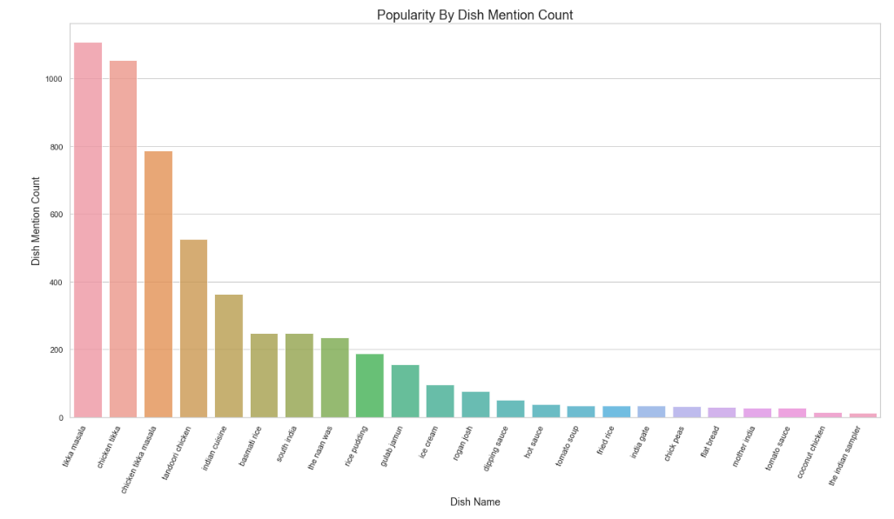
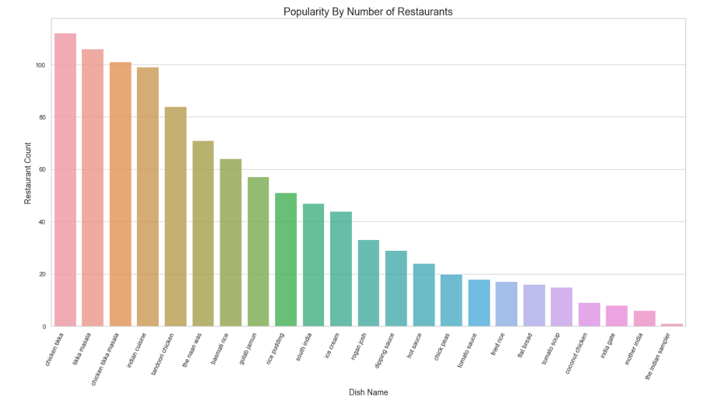
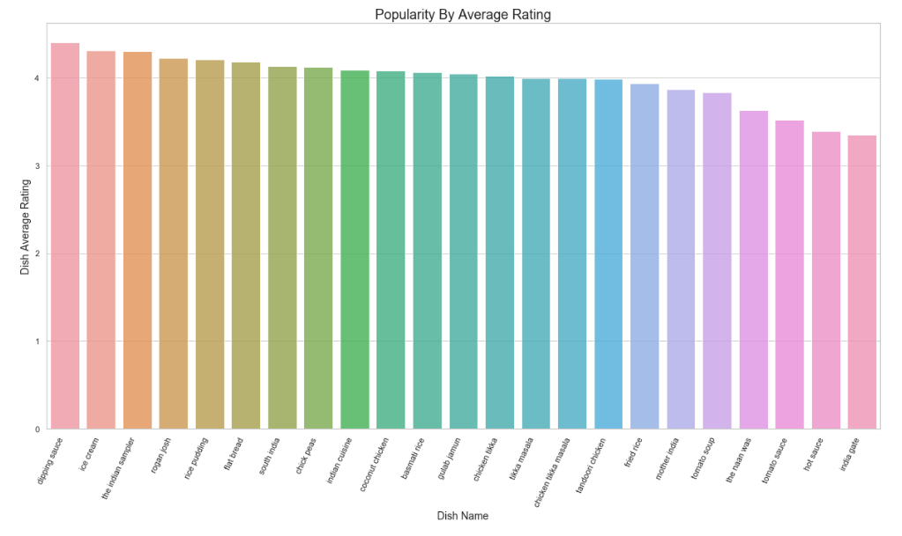
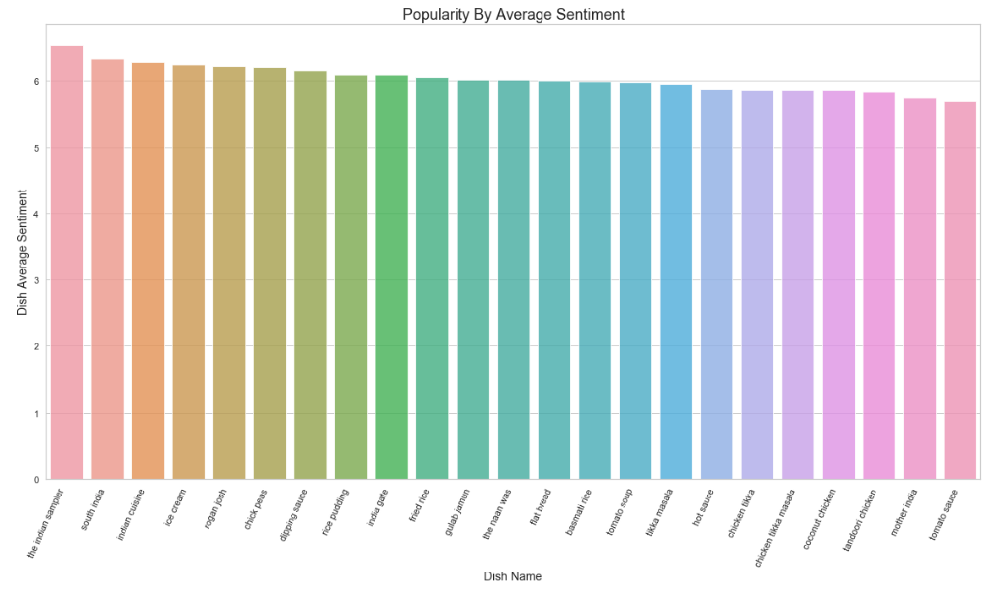
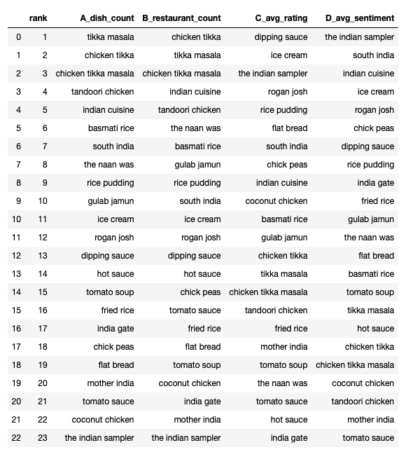
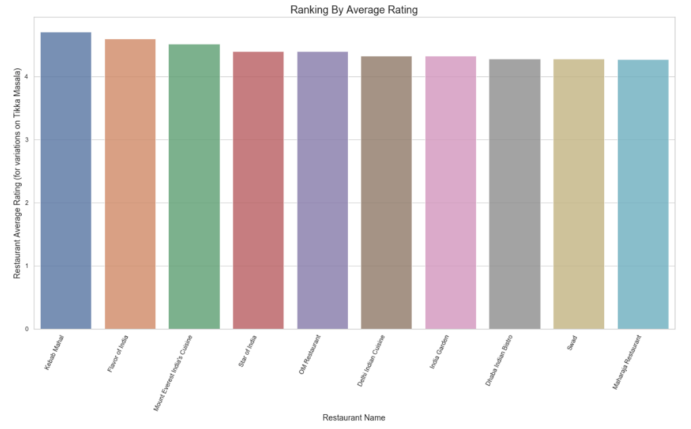
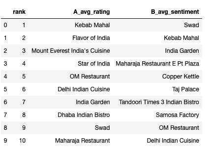

# Task 4 & 5
## By: Jonathan Chang (jc26)
*Note: The corresponding notebook for this report is at the following Github repo: https://github.com/jonchang03/cs598-dm-capstone/blob/master/task4%265/Task4%265.ipynb*

Now the goal of Tasks 4 and 5 is "to leverage recognized dish names to further help people making dining decisions." So for Task 4, we focus on 4 different ways of ranking the popularity of dishes in a given cuisine list, starting with a simpler count-based ranking and ending with a slightly more complex sentiment-based approach, and for Task 5, we explore how to recommend restaurants for particular dishes by examining a relevant subset of reviews and ranking using a similar methodology.

For tasks 4 and 5, we decide to continue our focus on Indian cuisine, and we use the dish list based on our corrected annotations from task 3. These dishes include:
```
['chick peas',
 'chicken tikka',
 'flat bread',
 'tandoori chicken',
 'rogan josh',
 'mother india',
 'gulab jamun',
 'basmati rice',
 'rice pudding',
 'hot sauce',
 'fried rice',
 'ice cream',
 'south india',
 'tomato soup',
 'indian cuisine',
 'chicken tikka masala',
 'tomato sauce',
 'india gate',
 'the indian sampler',
 'dipping sauce',
 'the naan was',
 'tikka masala',
 'coconut chicken']
 ```
 
To prepare for our subsequent analysis, we first subset our reviews to only include Indian restaurants, and we also capture the corresponding star ratings and restaurant names of these reviews. These will be necessary for when we do counts at a restaurant level or factor rating into our rankings. 

## Task 4

### 4A. Popularity By Dish Mention Count
"The simplest approach can be to simply count how many times a dish is mentioned in all the reviews of restaurants of a particular cuisine." We begin by using the simplest ranking sugested - namely, we count the number of times each of our dishes is mentioned in all the reviews of Indian cuisine. We can then sort our dishes by count, and then use the seaborn package's barplot for visualization.


### 4B. Popularity by Number of Retaurants
Here, we count total number of restaurants whose reviews mentioned a particular dish. This may help us avoid overly weighting certain reviews that may repeatedly mention a dish name. Again, we use seaborn's barplot, and we will continue to use it throught tasks 4 and 5 as our visualization of choice as it allows us both to easily distinguish between the rankings of the various dishes as well as easily compare between the different ranking methods.


### 4C. Popularity By Average Rating
Here, we try to utilize actual user feedback via star ratings for our popularity determination. For each dish, we compute an average rating metric, where a higher average rating leads to a higher ranking. We decide to "skip" reviews which gave 3 stars because those are fairly neutral, and a rating of 3 by a user usually doesn't give us much direction in terms of recommend/not recommend.


### 4D. Popularity By Sentiment

Finally, let's take user sentiment into account for our rankings. We need some way to capture the average sentiment of a particular dish, so we will turn to *TextBlob* which is one of the most popular Python packages for performing Sentiment Analysis. TextBlob provides a nice API which, given a piece of text, it returns a tuple containing polarity and subjectivity. We care about the polarity which is a float in the range of [-1,1], and to make our lives easier, we'll want to translate the range from [-1,1] to something like [0,10] which will allow us to capture an average sentiment. I used the following formula found [here](https://math.stackexchange.com/questions/377169/going-from-a-value-inside-1-1-to-a-value-in-another-range/377174#377174) for my translation.
```
Formula to transform range from [a,b] to [c,d], where we have [-1,1] to [0,10]
y = (x-a)(d-c)/(b-a) + c
y = 5*(x+1)
```

Note: Another common tool for text analysis is NLTK's VADER (Valence Aware Dictionary and Sentiment Reasoner) which also returns a polarity score in the same fashion. 



### Task 4 Discussion


As we can see in the comparison table the count-based ranking system, whether on a rating level or a restaurant level yields pretty similar results, which makes a lot of sense. The overall count would obviously be reduced when we are only counting restaurants as opposed to mentions, but the order of the counts remains. 

When we get to average rating and average sentiment, the results differ because we are ranking/comparing different items. For average rating, we were concerned with the average number of stars users gave a particular dish, and for average sentiment, we wanted to capture the dishes with the greatest positive polarity score. In my opinion, the question of ranking popularity really comes down to how we define "popularity" and whether popularity means higher-rated or more common. Perhaps we could even come up with our own algorithm that combines the 4 metrics explored.

If I had to select a method, I would probably go with the count of the total number of restaurants whose reviews mentioned a particular dish. For me, popularity is associated with a count (e.g. # of Instagram 👍), and for our particular dishes, I could recognize the chicken tikka masala, tandoori chicken, and naan dishes as popular Indian dishes.

## Task 5
Note: My go-to dish when I order from Indian restaurants is Chicken Tikka Masala - I know, I'm basic. So let's take the combination of dishes: *tikka masala, chicken tikka, chicken tikka masala* and determine how to rank the recommended restaurants.

### 5A. Recommendation By Average Rating
"A simple approach easy to implement is to collect all the reviews mentioning a dish and compute the average ratings of these reviews for each restaurant so that a restaurant whose reviews containing the dish have the highest average rating would be ranked on the top."

Here, we calculate the average ratings of the restaurants for our chosen dishes by dividing the total ratings by the number of reviews where at least one of them contains one of our selected dishes (essentially all pseudonyms for tikka masala). In computing the average, we add a small value to both the numerator and denominator to prevent potential division by zero.

After finding the average rating, we sort the restaurants in descending order by average rating (and then review count if a tiebreaker is needed), and filter out restaurants with fewer than 5 reviews (arbitrarily determined) because if a restaurant has an average rating of 5 stars, but only one review, we'd probably still recommend a restaurant with a slightly lower average but more reviews.  

Finally, we select the top 10 restaurants to recommend. This seemed appropriate because Yelp, and many other recommender systems usually return a page with approximately 10 results. Similar to Task 4, we use seaborn's barplot for our choice of visualization.



### 5B. Popularity By Average Sentiment

Here, we utilize the same TextBlob package and ranking methodology as Task 4D where we capture the average sentiment, but this time, on a restaurant level. We compute the scaled sentiment of each review pertaining to each restaurant that include tikka masala, and divide the sum of the scaled sentiment for a restaurant by the number of reviews observed. We ignore reviews with a star rating of 3, and like 5A, we are interested in the top 10 restaurants only after filtering out restaurants with fewer than 5 reviews. 


### Task 5 Discussion



As we can see, there is some overlap between the top 10 recommended restaurants by both ranking methodologies (e.g. Swad and Kebab Mahal), for the most part, the lists are different. I believe that both ranking methodologies produce meaningful results, however selecting which one should be used in an application might depend on the end user.  

For instance, an average rating ranking would is simple, safe, and works well for the vast majority of users. I know that when using Yelp, I personally use some combination of rating and I guess price ($$, something else I could have explored) to decide where I want to eat. However, sentiment scores and polarity is also a useful mechanism because in theory, it captures a user's strong feelings about a particular restaurant, and quite possibly the dish we have selected, and this is not always captured by the actual star rating system. So more adventurous useres, might prefer this kind of ranking system.

## References
* https://math.stackexchange.com/questions/377169/going-from-a-value-inside-1-1-to-a-value-in-another-range/377174#377174 - Scaling Sentiment Score
* https://textblob.readthedocs.io/en/dev/ - TextBlob for Sentiment Analysis